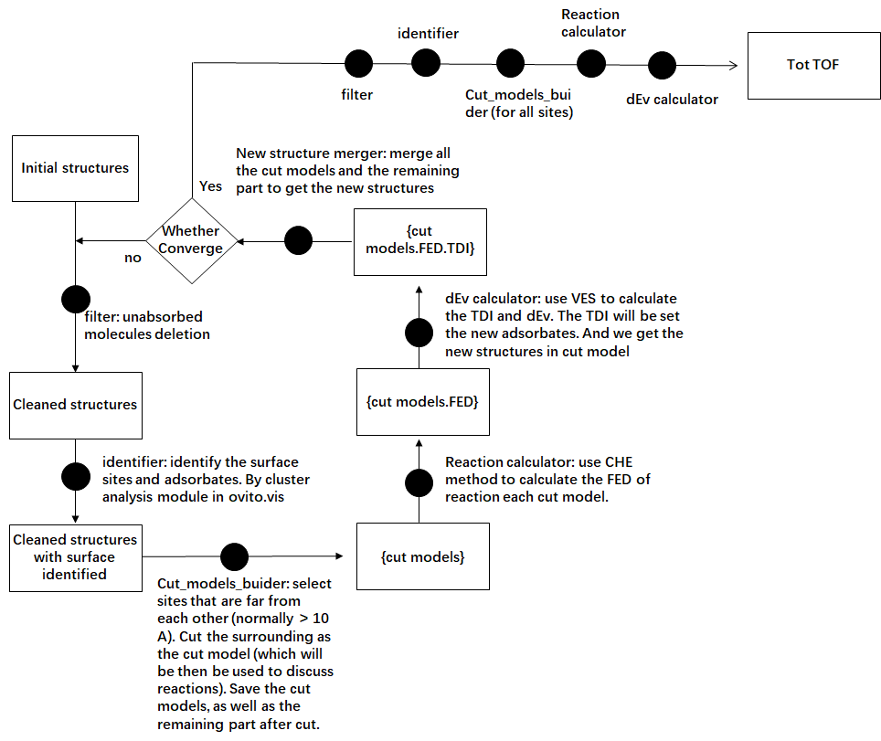

# Introduction
This project aims to establish a universal workflow for determining the equilibrium coverage of given catalyst model surfaces in electrocatalytic environments. The project utilizes machine learning potential (MLP) as the force field and combines the computational hydrogen electrode (CHE) method with the virtual energetic span (VES) approach to assess surface sites. Through extended iterations, the surface reaches a state of equilibrium.

# Workflow

# Usage

modify input.parameters to control the running  
then use ./main.py  to run the main iteration.  

# About MLP

If we disregard computational demand, all chemical phenomena can be described, understood, and predicted using quantum mechanics. However, limited by the significant computational requirements for precision in quantum mechanics and the current computers' relatively weak computational power, the simulation of many chemical phenomena remains at a very high level of approximation, filled with conjectures and so-called 'intuitive understanding'. Thus, enhancing computer capabilities or reducing the computational consumption of quantum mechanics are two fundamental and long-term directions for the development of chemical science. For the former, we currently depend on the development of quantum computing, where our ability to intervene is minimal. For the latter, a method known as machine learning potential (MLP)[1] has gradually emerged in the field.
MLP, as the name implies, is first and foremost a ‘potential’, meaning a force field (FF), which is a function that outputs the forces on each atom given an atomic structure. Its construction is based on machine learning methods applied to data (usually DFT data), hence the name machine learning potential. It can be understood as a very fast version of DFT (approximately 4-5 orders of magnitude faster in efficiency)[2] or a very accurate force field method (with force errors within 1 meV compared to DFT). Currently, molecular simulations based on MLP have become an important method for analyzing and simulating complex chemical processes.

# About CHE method
We adopted the computational hydrogen electrode (CHE) method[7] to deal with the charged species, including H+ and e. The chemical potential for associated adsorbates were calculated via the following expressions:
μA =EA+ZPE-TS                                  (8)
EA is the total energy of a certain molecule A or adsorbate *A. For molecule, EA can be obtained directly through a gas phase calculation; for a certain adsorbate, E*A is calculated by the difference between the DFT based substrate with (E*ADFT) and without adsorbate A (E*DFT):
E*A=E*ADFT-E*DFT                               (9)
ZPE and TS are the correction from zero point energy and, entropy, whose values are taken from previous work[7].

# About VES descriptor

CHE method uses the largest Gibbs energy (ΔGmax) as the activity determining term. This descriptor is proposed under the assumption of so-called “rate determining step assumption”: the slowest step should control the total kinetic of a series process[8]. However, for a multi-step reaction that takes place at limited position, such as catalytic reaction, it has been gradually noticed in last ten years that there is no such thing of a “rate determining step” (rds), instead, there should be a “rate determining state”[8]. That is, the catalytic activity should be co-determined by several steps. Based on such idea, one should avoid use ΔGmax, but to build some newly proposed descriptor that abandon the using of rds. There are now two such kinds of descriptors, one is the highest free energy of an reaction intermediate (denoted as Gmax(RI)) proposed by Exner et al[9]. The other is the “virtual energetic span” (δE^v) proposed by us[10]. And we will use the latter as the activity determining term in this paper.
The “virtual energetic span” δE^v comes from the “energetic span” that proposed by Kozuch et al[11]. It is the simplification of the result of a full microkinetic model. We won’t go into too much details here because it have given detailed illustration in ref.[10]. Here we only give its brief conclusion: to use the virtual energetic span, we can still follow the basic principal of CHE method, to build a TS-free FED. What is different from CHE approach is we can treat the mid-point of each joint line in FED, as the “virtual transition states (TSv)”. We name it virtual transition state because it is not the real energy of the transition state, but it has a constant difference to the real energy of the transition state. This can strictly proved under the CHE method. Among those TSv, there is one that determines the turnover frequency (TOF), we name it the TOF determining TSv, aliased as TDTSv. On the other hand, for the energies of the intermediates, that is, the energy levels of the steps in FED, there is also one step that determines the activity. It is named as the TOF determining intermediate (TDI). The δE^v is calculated simply by the difference between TDTSv and TDI:
